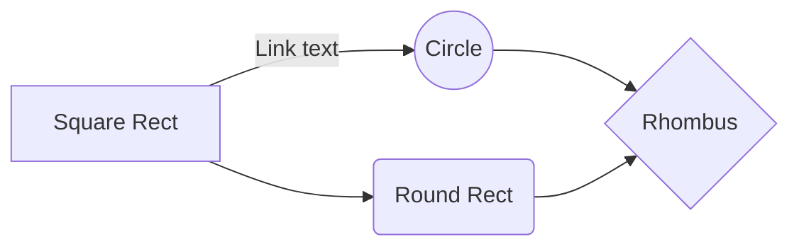

# Pull Request Workflow

Open and refine pull requests. These instructions are derived from the author's
global development constitution.

## Title Convention

The `GITMOJI` environment variable controls which format to use:

- **`GITMOJI=1`** → gitmoji emoji prefixes (✨, 🐛, ♻️)
- **Unset or any other value** → conventional commit type prefixes (`feat:`, `fix:`, `chore:`)

Both formats follow the same structure:

```
<type> [scope?][:?] <summary>
```

If the title needs "and" in the summary, the PR is too broad — narrow the scope.

### Gitmoji mode (`GITMOJI=1`)

| Prefix | Intent                         |
| ------ | ------------------------------ |
| ✨     | New feature                    |
| 🐛     | Bug fix                        |
| 💥     | Breaking change                |
| ♻️     | Refactor                       |
| 📝     | Documentation                  |
| ⚡     | Performance                    |
| 🧪     | Tests                          |
| 🔧     | Configuration                  |
| ⬆️     | Dependency bump                |
| 🎉     | Initial commit / project start |
| 🔖     | Version bump                   |
| 📈     | Analytics                      |
| ♿️     | Accessibility                  |
| 🌐     | Internationalization           |

**Examples:**

- `🎉 package-name` — initial commit
- `✨ Add login via OAuth`
- `🐛 Fix onClick event handler`
- `⚡️ Lazyload home screen images`
- `♻️ (components): Transform classes to hooks`
- `♿️ (account): Improve modals a11y`
- `📈 Add analytics to the dashboard`
- `🌐 Support Japanese language`
- `🔖 Bump version to 1.2.0`

Full commit message with body:

```
⚡️ Lazyload home screen images

Optimize performance by loading images only when they are
about to enter the viewport.
```

For breaking changes, include the `BREAKING CHANGE:` footer in the body:

```
💥️ Remove support for legacy auth

BREAKING CHANGE: Legacy username/password auth is no longer
supported. Users must migrate to OAuth before upgrading.
```

### Conventional Commit mode (default)

| Type       | Intent                       |
| ---------- | ---------------------------- |
| `feat`     | New feature                  |
| `fix`      | Bug fix                      |
| `refactor` | Refactor                     |
| `docs`     | Documentation                |
| `perf`     | Performance                  |
| `test`     | Tests                        |
| `chore`    | Configuration, deps, version |
| `ci`       | CI/CD pipelines              |
| `build`    | Build system / tooling       |
| `style`    | Formatting (no logic change) |
| `revert`   | Revert a prior commit        |

**Examples:**

- `feat: add login via OAuth`
- `fix: resolve race condition in checkout`
- `refactor(components): transform classes to hooks`
- `perf: lazyload home screen images`
- `docs: document OAuth flow`
- `test: add checkout edge case coverage`
- `ci: add release workflow`
- `chore: bump version to 1.2.0`

Full commit message with body:

```
feat(perf): increase parallel computations

Use asynchronous thread workers to get more work done
concurrently.
```

For breaking changes, include the `BREAKING CHANGE:` footer in the body:

```
feat: remove support for legacy auth

BREAKING CHANGE: Legacy username/password auth is no longer
supported. Users must migrate to OAuth before upgrading.
```

### Scope and Ticket Numbers

When a ticketing system (Jira, Linear, GitHub Issues, etc.) is in use, put the ticket
number as the scope:

| Mode         | Example                              |
| ------------ | ------------------------------------ |
| Gitmoji      | `✨ (CED-123): Add login via OAuth`  |
| Conventional | `feat(CED-123): add login via OAuth` |

## Opening a PR

### Before Opening

1. Push the branch: `git push -u origin HEAD`
2. Self-review: `gh pr diff` — read every changed line as if you were the reviewer
3. Check CI: `gh pr checks` — do not open the PR until it passes

### Creating the PR

Write the PR body to a temp file first, then create the PR with `--body-file`:

```bash
mkdir -p /tmp/pr
BODY_FILE="/tmp/pr/$(uuidgen).md"
PR_BODY="$(cat <<EOF
## Summary
...
EOF
)"
echo "${PR_BODY}" > "${BODY_FILE}"
gh pr create \
  --title "<type> [scope?]: <summary>" \
  --body-file "${BODY_FILE}"
```

Use `gh pr create --web` if the user wants to preview in the browser before
submitting.

### PR Body Template

Write this to the temp file before running `gh pr create`:

````
## Summary

[Concise summary of what this PR achieves.]

## Context

[The "why" behind this work — feature, bugfix, or chore reasoning.]

## Changes

[Detailed description of code changes, ideally organized by file or feature area.]

<details><summary>Code Changes</summary>
<p>

- **`path/to/file.py`**
  - Detailed description of changes.
</p>
</details>

## Test Plan

[Steps to verify changes work as intended, only include manual/post-merge steps if necessary.]

- [x] Initial verification (completed by agent or user).
- [ ] Manual verification step.
- [ ] Post-merge verification if necessary.

## Behavior Diagram

[Only if relevant: a Mermaid diagram explaining this PR]


````

### PR Rules

- PR titles must use the commit format described in [Title Convention](#title-convention)
- Never credit yourself as a Co-Author in the PR description
- Never indicate that the PR was created by an agent unless explicitly asked
- If the project has its own PR template, prefer that over this one
- Never force-push to main/master

## Refining a PR

### Responding to Reviews

1. Fetch review comments: `gh pr view --comments`
2. For each unresolved thread, either make the code change or reply with
   `gh pr comment --body "..."` explaining why not
3. When a change addresses a thread, reply to that thread with
   `gh pr comment --body "..."` so the reviewer knows it was handled
4. Never resolve threads yourself — let the reviewer confirm and resolve
5. Don't take review feedback personally — the goal is better code

### Pushing Updates

1. Make requested changes in a new commit — do not amend unless the reviewer
   explicitly asks you to squash
2. Push: `git push origin HEAD`
3. Watch CI: `gh pr checks --watch`
4. Re-request review if the platform requires it

### Viewing PR State

- `gh pr view` — summary of the PR (title, body, status, checks)
- `gh pr view --comments` — all review comments and threads
- `gh pr checks` — CI status for the current branch
- `gh pr status` — list PRs you've opened or are assigned to review

## Security

- No PHI/PII in code, comments, or PR descriptions
- No secrets or API keys — use environment variables
- Never read `.env` files or decrypt secrets into context
