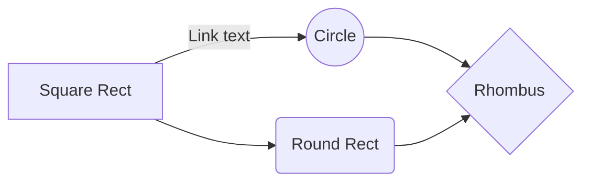

# Pull Request Workflow

Open and refine pull requests. These instructions are derived from the author's
global development constitution.

## Gitmoji Title Convention

PR titles use the Gitmoji conventional commit format:

```
<gitmoji> [scope?][:?] <summary>
```

| Gitmoji | Intent                         |
| ------- | ------------------------------ |
| ✨      | New feature                    |
| 🐛      | Bug fix                        |
| 💥      | Breaking change                |
| ♻️      | Refactor                       |
| 📝      | Documentation                  |
| ⚡      | Performance                    |
| 🧪      | Tests                          |
| 🔧      | Configuration                  |
| ⬆️      | Dependency bump                |
| 🎉      | Initial commit / project start |
| 🔖      | Version bump                   |
| 📈      | Analytics                      |
| ♿️      | Accessibility                  |
| 🌐      | Internationalization           |

If the title needs "and" in the summary, the PR is too broad — narrow the scope.

## Opening a PR

### Before Opening

1. Push the branch: `git push -u origin HEAD`
2. Self-review: `gh pr diff` — read every changed line as if you were the reviewer
3. Check CI: `gh pr checks` — do not open the PR until it passes

### Creating the PR

Write the PR body to a temp file first, then create the PR with `--body-file`:

```bash
mkdir -p /tmp/pr
BODY_FILE="/tmp/pr/$(uuidgen).md"
PR_BODY="$(cat <<EOF
## Summary
...
EOF
)"
echo "${PR_BODY}" > "${BODY_FILE}"
gh pr create \
  --title "<gitmoji> [scope?]: <summary>" \
  --body-file "${BODY_FILE}"
```

Use `gh pr create --web` if the user wants to preview in the browser before
submitting.

### PR Body Template

Write this to the temp file before running `gh pr create`:

````
## Summary

[Concise summary of what this PR achieves.]

## Context

[The "why" behind this work — feature, bugfix, or chore reasoning.]

## Changes

[Detailed description of code changes, ideally organized by file or feature area.]

<details><summary>Code Changes</summary>
<p>

- **`path/to/file.py`**
  - Detailed description of changes.
</p>
</details>

## Test Plan

[Steps to verify changes work as intended, only include manual/post-merge steps if necessary.]

- [x] Initial verification (completed by agent or user).
- [ ] Manual verification step.
- [ ] Post-merge verification if necessary.

## Behavior Diagram

[Only if relevant: a Mermaid diagram explaining this PR]


````

### PR Rules

- PR titles must use the gitmoji conventional commit format above
- Never credit yourself as a Co-Author in the PR description
- Never indicate that the PR was created by an agent unless explicitly asked
- If the project has its own PR template, prefer that over this one
- Never force-push to main/master

## Refining a PR

### Responding to Reviews

1. Fetch review comments: `gh pr view --comments`
2. For each unresolved thread, either make the code change or reply with
   `gh pr comment --body "..."` explaining why not
3. When a change addresses a thread, reply to that thread with
   `gh pr comment --body "..."` so the reviewer knows it was handled
4. Never resolve threads yourself — let the reviewer confirm and resolve
5. Don't take review feedback personally — the goal is better code

### Pushing Updates

1. Make requested changes in a new commit — do not amend unless the reviewer
   explicitly asks you to squash
2. Push: `git push origin HEAD`
3. Watch CI: `gh pr checks --watch`
4. Re-request review if the platform requires it

### Viewing PR State

- `gh pr view` — summary of the PR (title, body, status, checks)
- `gh pr view --comments` — all review comments and threads
- `gh pr checks` — CI status for the current branch
- `gh pr status` — list PRs you've opened or are assigned to review

## Security

- No PHI/PII in code, comments, or PR descriptions
- No secrets or API keys — use environment variables
- Never read `.env` files or decrypt secrets into context
