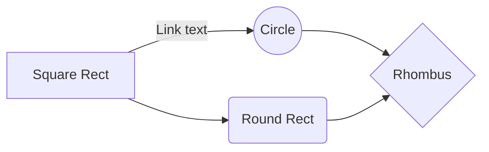

# Pull Request Workflow

Open and refine pull requests.

## Tool Use

Requires `git`, an authenticated GitHub CLI (`gh`), shell execution, and network
access for GitHub operations. Run the project's existing checks through `task`
when available.

Use `gh pr` for ordinary PR operations and `gh api` when inline review threads or
other details are unavailable through `gh pr`. Request only the JSON fields
needed with `--json` and `--jq`; paginate API lists so comments are not missed.
Follow the host's permissions and the user's authorization for external actions.

Unlisted commands follow the host's normal permission flow. This includes
`gh api graphql`, which can execute both queries and mutations.

Write multiline bodies and replies to temporary files using the host's file
tools or a quoted heredoc. Use `--body-file` with `gh pr` and `--field body=@file`
with `gh api`; avoid interpolating prose into shell commands. Shell examples use
POSIX syntax; adapt them to the host shell when necessary.

## Title Convention

The `GITMOJI` environment variable controls which format to use:

- **`GITMOJI=1`** → gitmoji emoji prefixes (✨, 🐛, ♻️)
- **Unset or any other value** → conventional commit type prefixes (`feat:`, `fix:`, `chore:`)

Both formats follow the same structure:

```
<type> [scope?][:?] <summary>
```

If the title needs "and" in the summary, the PR is too broad — narrow the scope.

### Gitmoji mode (`GITMOJI=1`)

| Prefix | Intent                         |
| ------ | ------------------------------ |
| ✨     | New feature                    |
| 🐛     | Bug fix                        |
| 💥     | Breaking change                |
| ♻️     | Refactor                       |
| 📝     | Documentation                  |
| ⚡     | Performance                    |
| 🧪     | Tests                          |
| 🔧     | Configuration                  |
| ⬆️     | Dependency bump                |
| 🎉     | Initial commit / project start |
| 🔖     | Version bump                   |
| 📈     | Analytics                      |
| ♿️     | Accessibility                  |
| 🌐     | Internationalization           |

**Examples:**

- `🎉 package-name` — initial commit
- `✨ Add login via OAuth`
- `🐛 Fix onClick event handler`
- `⚡️ Lazyload home screen images`
- `♻️ (components): Transform classes to hooks`
- `♿️ (account): Improve modals a11y`
- `📈 Add analytics to the dashboard`
- `🌐 Support Japanese language`
- `🔖 Bump version to 1.2.0`

Full commit message with body:

```
⚡️ Lazyload home screen images

Optimize performance by loading images only when they are
about to enter the viewport.
```

For breaking changes, include the `BREAKING CHANGE:` footer in the body:

```
💥️ Remove support for legacy auth

BREAKING CHANGE: Legacy username/password auth is no longer
supported. Users must migrate to OAuth before upgrading.
```

### Conventional Commit mode (default)

| Type       | Intent                       |
| ---------- | ---------------------------- |
| `feat`     | New feature                  |
| `fix`      | Bug fix                      |
| `refactor` | Refactor                     |
| `docs`     | Documentation                |
| `perf`     | Performance                  |
| `test`     | Tests                        |
| `chore`    | Configuration, deps, version |
| `ci`       | CI/CD pipelines              |
| `build`    | Build system / tooling       |
| `style`    | Formatting (no logic change) |
| `revert`   | Revert a prior commit        |

**Examples:**

- `feat: add login via OAuth`
- `fix: resolve race condition in checkout`
- `refactor(components): transform classes to hooks`
- `perf: lazyload home screen images`
- `docs: document OAuth flow`
- `test: add checkout edge case coverage`
- `ci: add release workflow`
- `chore: bump version to 1.2.0`

Full commit message with body:

```
feat(perf): increase parallel computations

Use asynchronous thread workers to get more work done
concurrently.
```

For breaking changes, include the `BREAKING CHANGE:` footer in the body:

```
feat: remove support for legacy auth

BREAKING CHANGE: Legacy username/password auth is no longer
supported. Users must migrate to OAuth before upgrading.
```

### Scope and Ticket Numbers

When a ticketing system (Jira, Linear, GitHub Issues, etc.) is in use, put the ticket
number as the scope:

| Mode         | Example                              |
| ------------ | ------------------------------------ |
| Gitmoji      | `✨ (ENG-123): Add login via OAuth`  |
| Conventional | `feat(ENG-123): add login via OAuth` |

## Opening a PR

### Before Opening

1. Confirm the intended base branch in `BASE_BRANCH`. Run the project's required
   checks and self-review with `git diff "${BASE_BRANCH}"...HEAD`. Review any
   uncommitted changes that will be included separately.
2. Push the branch: `git push -u origin HEAD`.
3. Identify configured CI and its triggers. For GitHub Actions, list runs for the
   pushed commit with
   `gh run list --branch "$(git branch --show-current)" --commit "$(git rev-parse HEAD)"`.
   Check other CI providers separately and wait for applicable checks to pass.
   If expected runs have not appeared, retry briefly; if still missing, report CI
   as unverified. An empty run list does not prove that no branch CI applies:
   confirm that from the CI configuration before proceeding without branch checks.
   Check PR-triggered checks after creation.

`gh pr diff` and `gh pr checks` require an existing PR; use them after creation.

### Creating the PR

Write the PR body to a temp file first, then create the PR with `--body-file`:

```bash
BODY_FILE="$(mktemp "${TMPDIR:-/tmp}/pr-body.XXXXXX")"
cat > "${BODY_FILE}" <<'EOF'
## Summary
...
EOF
gh pr create \
  --base "${BASE_BRANCH}" \
  --title "<type> [scope?]: <summary>" \
  --body-file "${BODY_FILE}"
```

Use `gh pr create --web` if the user wants to preview in the browser before
submitting.

### PR Body Template

Write this to the temp file before running `gh pr create`:

````
## Summary

[Concise summary of what this PR achieves.]

## Context

[The "why" behind this work — feature, bugfix, or chore reasoning.]

## Changes

[Detailed description of code changes, ideally organized by file or feature area.]

<details><summary>Code Changes</summary>
<p>

- **`path/to/file.py`**
  - Detailed description of changes.
</p>
</details>

## Test Plan

[Steps to verify changes work as intended, only include manual/post-merge steps if necessary.]

- [x] Initial verification (completed by agent or user).
- [ ] Manual verification step.
- [ ] Post-merge verification if necessary.

## Behavior Diagram

[Only if relevant: a Mermaid diagram explaining this PR]


```mermaid
graph LR
    A[Square Rect] -- Link text --> B((Circle))
    A --> C(Round Rect)
    B --> D{Rhombus}
    C --> D
```
````

### PR Rules

- PR titles must use the commit format described in [Title Convention](#title-convention)
- Describe the PR's final state: what the changes achieve and why. Omit
  intermediate attempts, discarded approaches, and implementation thought processes.
- Keep the title and description up to date whenever newly pushed code materially
  changes the PR.
- Before creating or updating the PR body, remove hard line breaks within prose
  paragraphs so they render cleanly on GitHub. Preserve blank lines and structural
  line breaks in lists, tables, and code blocks.
- Never credit yourself as a Co-Author in the PR description
- Never indicate that the PR was created by an agent unless explicitly asked
- If the project has its own PR template, prefer that over this one
- Never force-push to main/master

## Refining a PR

### Updating the Title and Body

Prepare the revised body in `BODY_FILE` and confirm the target PR number in
`PR_NUMBER`. Apply the final-state and paragraph-formatting rules above:

```bash
gh pr edit "${PR_NUMBER}" \
  --title "<type> [scope?]: <final summary>" \
  --body-file "${BODY_FILE}"
gh pr view "${PR_NUMBER}" --json title,body,url
```

### Responding to Reviews

1. Read conversation comments and review summaries with `gh pr view --comments`.
   Fetch inline review comments with the paginated API example below. When thread
   resolution state matters, query `reviewThreads` and `isResolved` through
   `gh api graphql`, paginating the results.
2. For each actionable comment, make the requested change or explain why not.
   Prepare the response in `REPLY_FILE` and reply to the original inline review
   comment using its top-level `COMMENT_ID`.
3. Use `gh pr comment "${PR_NUMBER}" --body-file "${REPLY_FILE}"` for a general
   conversation reply; it does not reply inside an inline review thread.
4. Never resolve threads yourself — let the reviewer confirm and resolve.
5. Don't take review feedback personally — the goal is better code.

With the target PR number in `PR_NUMBER`, fetch inline comments and reply using
the ID of the original comment, not a reply's ID:

```bash
gh api --method GET --paginate "repos/{owner}/{repo}/pulls/${PR_NUMBER}/comments"
gh api --method POST "repos/{owner}/{repo}/pulls/${PR_NUMBER}/comments/${COMMENT_ID}/replies" \
  --field "body=@${REPLY_FILE}"
```

The `{owner}` and `{repo}` placeholders resolve from the current repository.
Verify they identify the PR's repository, especially when working from a fork.

### Pushing Updates

1. Make requested changes in a new commit — do not amend unless the reviewer
   explicitly asks you to squash
2. Push: `git push origin HEAD`
3. Update the title and description if the PR's scope materially changed.
4. Watch CI: `gh pr checks --watch`
5. Re-request review when needed with `gh pr edit --add-reviewer <login>`.

### Viewing PR State

- `gh pr view` — summary of the PR (title, body, status, checks)
- `gh pr view --comments` — conversation comments and review summaries
- `gh api` — inline review comments, thread state, and thread replies
- `gh pr checks` — CI status for the current branch
- `gh pr status` — list PRs you've opened or are assigned to review

## Security

- No PHI/PII in code, comments, or PR descriptions
- No secrets or API keys — use environment variables
- Never read `.env` files or decrypt secrets into context
